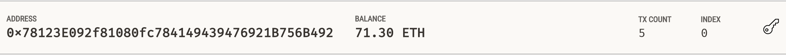
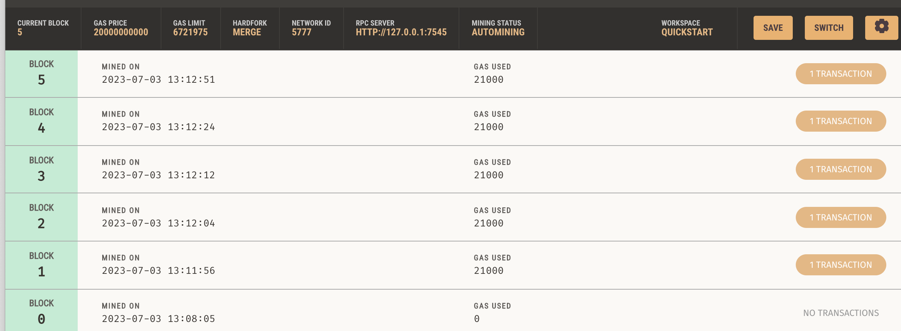
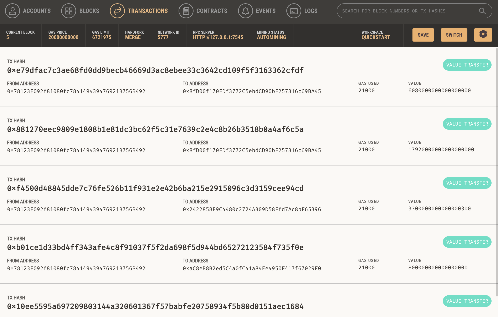
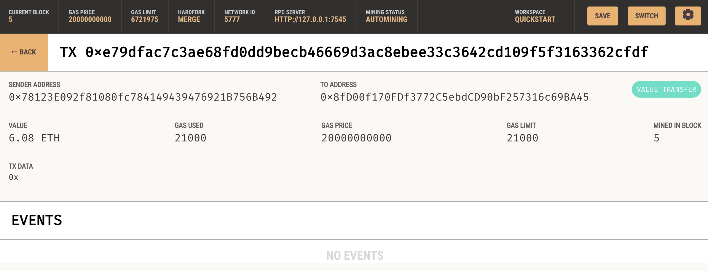

Cryptocurrency Wallet

### Background

KryptoJobs2Go is an application that its customers can use to find fintech professionals from among a list of candidates, hire them, and pay them. As KryptoJobs2Go’s lead developer, you have been tasked with integrating the Ethereum blockchain network into the application in order to enable your customers to instantly pay the fintech professionals whom they hire with cryptocurrency.

### Tasks

* Generate a new Ethereum account instance by using the mnemonic seed phrase provided by Ganache.

* Fetch and display the account balance associated with your Ethereum account address.

* Calculate the total value of an Ethereum transaction, including the gas estimate, that pays a KryptoJobs2Go candidate for their work.

* Digitally sign a transaction that pays a KryptoJobs2Go candidate, and send this transaction to the Ganache blockchain.

* Review the transaction hash code associated with the validated blockchain transaction.

#### Step 1: Import Ethereum Transaction Functions into the KryptoJobs2Go Application

#### Step 2: Sign and Execute a Payment Transaction

* KryptoJobs2Go Platform

#### Step 3: Inspect the Transaction

---

* Account balance

* Blocks

* Transactions

* Transaction detail

